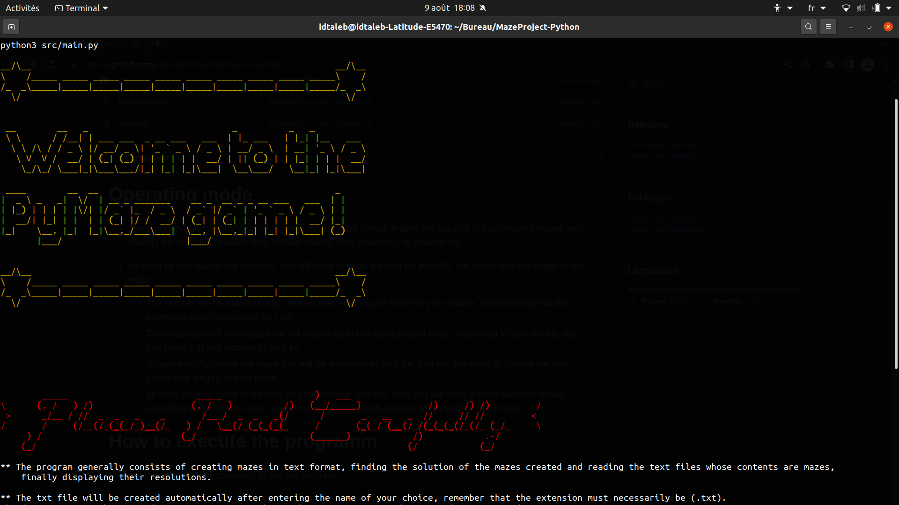
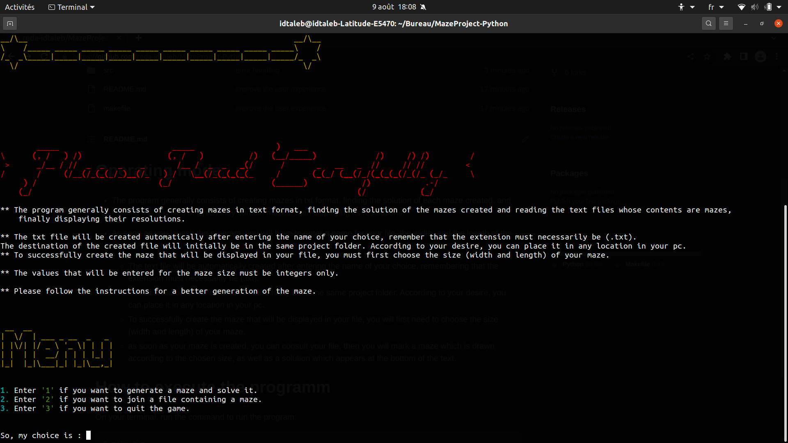

# PyMaze Game

# Context
The program consists of generating mazes in text format, finding their solutions, extracting the mazes from text files and finally displaying their solutions.

# Operating mode
- As soon as you launch the program, you will have to enter a name for your file, the width, and the length of the maze:
   * The text file will be automatically created after entering the name of your choice, remembering that the extension must necessarily be (.txt).
   * as soon as your maze is created, you can consult your file, then you will mark a maze which is drawn according to the chosen size, as well as a solution which appears at the bottom of the text.

# How to execute the programm
On your terminal, run the command to run the program:

``` bash
$ make run
```

# Screen shots
## Welcomig screen


## Menu screen


