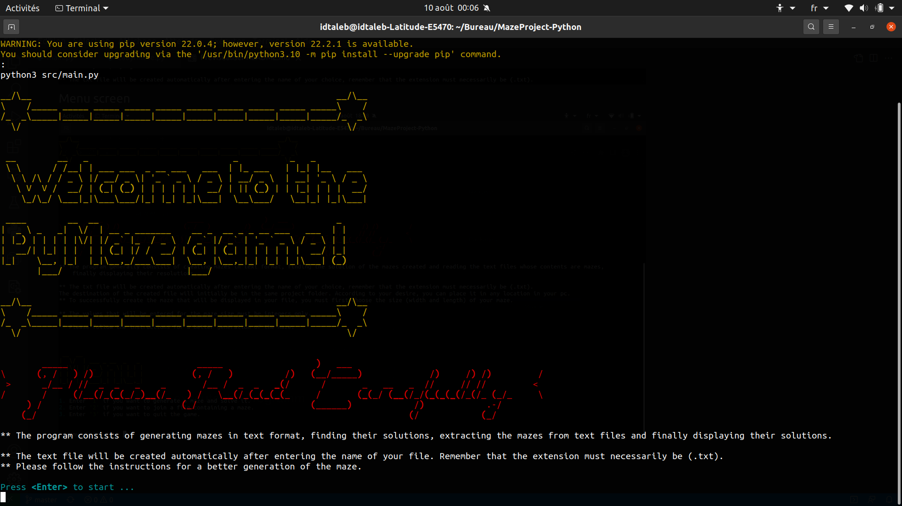
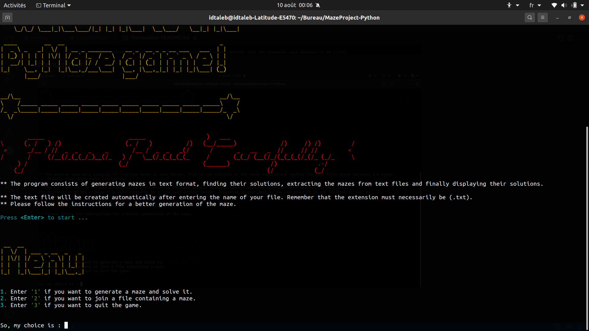
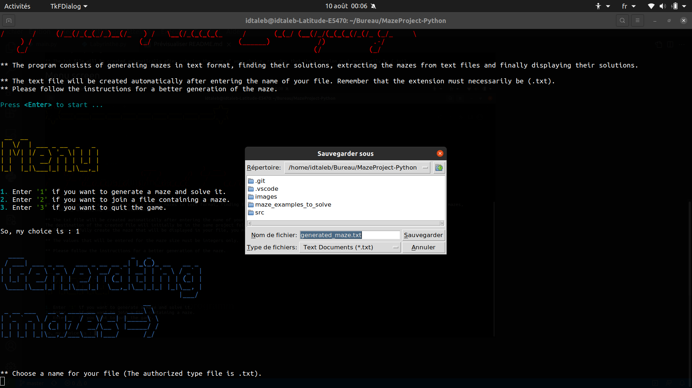

# PyMaze Game

# Context
The program consists of generating mazes in text format, finding their solutions, extracting the mazes from text files and finally displaying their solutions.

# How to execute the programm
On your terminal, run the command to run the program:

``` bash
$ make run
```

# Screen shots
## Welcomig screen
-----


</br>

## Menu screen
-----


</br>

## Generating mazes
-----


</br>

## Solving mazes
-----


</br>

## Exit the game
-----

